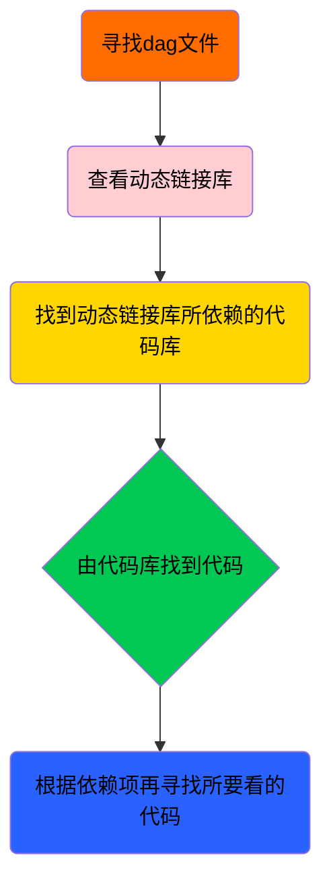

# 基础知识

在进行控制实验之前首先需要掌握一些基础知识，其中有三个知识很重要，需要了解并且掌握其基础部分，这三个知识如下：
- [[Docker]]
- [[Protobuf]]
- [[Bazel]]
在做实验与学习的过程中我们也应该记住一些常见的Linux基础命令。[常见基础命令点击此处](https://mp.weixin.qq.com/s/nyPNf514u6KxzGIQE-BCPA)

# 代码逻辑框架

在掌握前面的基础知识之后，开始针对我的控制代码逻辑进行说明讲解。

## Apollo代码的简单执行流程
下面是整体框架的概述图，目前我所了解的主要是建图，定位，规划，主要掌握的是控制部分。==这篇笔记的重点放在控制实验上。==
![[概述图.jpeg]]

感知算法以及底盘相关的知识不是很清楚，就不提相关内容了。下面简单的讲一下目前所了解的建图，定位，规划代码的一些逻辑。

### 组件
		  Apollo组件中就是分为两种组件，一种是消息触发组件，另一种是时间触发组件。
- Component提供消息融合机制，最多可以支持 4 路消息融合，当 从多个 Channel 读取数据的时候，以第一个 Channel 为主 Channel。当主 Channel 有消息到达，Cyber RT会调用 Component的`Proc()`进行一次数据处理。

- TimerComponent不提供消息融合，与Component不同的是TimeComponent的 `Proc()`函数不是基于主channel触发执行，而是由系统定时调用，开发者可以在配置文件中确定调用的时间间隔。

### 建图与定位
在Apollo的建图与定位中，我们首先利用车辆的激光雷达传感器扫描周围环境获取得到点云点的record数据包，获取数据包以后进行播放利用NDT Mapping算法生成点云文件。代码文件是modules\mapping\ndt\ndt_mapping_component.cc，生成点云文件以后./bazel-bin/modules/mapping/pcd2png/pcd2pnd_tools将文件转换成图片，根据生成的图片在地图标注工具中进行标注。具体详细的地图制作步骤请看[[高精地图制作]]。

NDT Mapping算法：算法的功能是通过激光雷达数据和 NDT 匹配算法，逐帧对点云进行配准，构建局部和全局点云地图，并与 GNSS/RTK 提供的全局参考位姿进行融合。其代码文件在modules\localization\lox\ndt_localization_component_fusion.cc

> [!NOTE]
> 具体的算法实现请看源代码


### 规划

在Apollo7.0的版本中还是将routing与planning分开成为了两个模块。
1.  routing是全局路径搜索，这是一个消息触发组件，当有RoutingRequest传过来以后才会触发如果高精地图以道路网络的节点形式表示（如拓扑图、路网图），那么 A* 算法可以直接使用这些节点和边，然后在拓扑图中搜索连接起始点的最优路径RoutingResponse，作为输出发送出去。
2. planning模块则是局部规划的实现，这也是一个消息触发组件。它主要利用了双层状态机以及场景化的思想，在Top Layer中进行场景切换，ScenarioManager根据周围的环境和地图信息，决定需要切换到哪个场景，如LaneFollow沿道路行驶的场景，PullOver靠边停车的场景。在Bottom Layer中进行Stage的切换，如果上个Stage已经执行完成，继续执行下一个Stage。如果所有的Stage都执行完毕，认为当前Scenario也执行完毕。就是根据不同的场景来分配场景然后执行每个场景中的阶段，每个阶段又可以执行不同的任务。也就是说stage是怎么执行的--就是由task的代码来完成。
目前控制实验在规划主要使用的是lane_follow场景，然后Apollo 的规划思路是横纵向解耦，基于参考线将规划问题解耦为SL坐标系中的路径规划和ST坐标系中的速度规划。先规划 path，再规划 speed。具体的，对于 path 来说，先做出是否需要 lane_change 或者 lane_borrow 的决策，再根据决策状态来生成凸空间，最终基于 reference_line 及凸空间求解一个二次优化问题，从而得到优化后的 path。对于 speed 来说，是基于 ST 图进行 DP+QP 的优化方法，先利用 DP 来找到一个 cost 值最小的可行解，再利用 QP 对可行解进行平滑，得到最终平滑后的 ST 图点集。最终，基于 s 值对 path 和 speed 进行融合，得到一条平滑的轨迹。

关于规划的内容以后有时间会阅读一下源代码，完善上面所说内容。
> [!bug] 注意！！！！！！！！！！！
> 由于没有完全详细看过规划的代码，而且规划的代码体系又十分的庞大，上面所说内容不一定正确，请务必注意！


## 控制代码
控制的代码相比其他模块来说还是相对简单的。有了前面的知识基础后学习控制的代码，我个人觉得要分下面三个方向来学习与开发。
1. 代码怎么看？
2. 控制器的逻辑怎么看 ，怎么写？
3. 配置代码要怎么写？
### 代码怎么看（文字版）
1. 先去看[[dag]]文件，他能最快帮你锁定执行的是哪个源文件从而理清楚代码的执行逻辑。
我们会在fr09_pro.pb.txt文件中^[目录为modules\dreamview\conf\hmi_modes\fr09_pro.pb.txt]看到如下代码块：
```
cyber_modules {
  key: "Control"
  value: {
    dag_files: "/apollo/modules/control/dag/control.dag"
  }
}
```
他的意思就是我们点击dreamview中control来启动control模块，如图所示：
![[1711003101340.png]]
我们也可以通过手动输入命令mainboard -d modules\control\dag\control.dag来启动控制模块，两种方式都可以。代码块与界面点击结合的方式和手动命令都说明了我们是通过这个[[dag]]文件实现代码执行的。接下来看具体的代码实现，以下代码都来自cotrol.dag文件^[目录为modules\control\dag\control.dag]
```
module_config {
    module_library : "/apollo/bazel-bin/modules/control/libcontrol_component.so"

    timer_components {
        class_name : "ControlComponent"
        config {
            name: "control"
            flag_file_path: "/apollo/modules/control/conf/control.conf"
            interval: 10
        }
    }
}
```
代码中module_library : "/apollo/bazel-bin/modules/control/libcontrol_component.so"就是在写代码所需要的动态链接库（一般会是一个二进制文件）即libcontrol_component.so，我们在编辑器中搜索libcontrol_component.so就会在一个build文件中找到它。
> 代码中其他部分自行了解学习，该代码是protobuf使用的语言。

2. 第二步就是要学会怎么看build文件，这个build就是bazel写的构建工程代码。
第一部帮我们定位到这个文件以后我们来看一下它的代码
```
cc_library(

    name = "control_lib",

    copts = CONTROL_COPTS,

    deps = [

        "//cyber",

        "//cyber/time:clock",

        "//modules/canbus/proto:chassis_cc_proto",

        "//modules/common/adapters:adapter_gflags",

        "//modules/common/latency_recorder",

        "//modules/common/monitor_log",

        "//modules/common/util",

        "//modules/control/common",

        "//modules/control/controller",

        "//modules/control/proto:control_cmd_cc_proto",

        "//modules/control/proto:control_conf_cc_proto",

        "//modules/control/proto:pad_msg_cc_proto",

        "//modules/control/proto:preprocessor_cc_proto",

        "//modules/control/submodules:lat_lon_controller_submodule_lib",

        "//modules/control/submodules:mpc_controller_submodule_lib",

        "//modules/control/submodules:postprocessor_submodule_lib",

        "//modules/control/submodules:preprocessor_submodule_lib",

        "//modules/localization/proto:localization_cc_proto",

        "//modules/planning/proto:planning_cc_proto",

        "@com_github_gflags_gflags//:gflags",

    ],

)
cc_library(

    name = "control_component_lib",

    srcs = ["control_component.cc"],

    hdrs = ["control_component.h"],

    copts = CONTROL_COPTS,

    deps = [

        ":control_lib",

        "//modules/control/common:dependency_injector",

    ],

)
cc_binary(

    name = "libcontrol_component.so",

    linkshared = True,

    linkstatic = False,

    deps = [":control_component_lib"],

)
```
代码可以看到libcontrol_component.so的生成是依赖于control_component_lib，而control_component_lib的生成代码来源是---源文件control_component.cc与头文件control_component.h的代码，同时control_component_lib依赖于一个叫control_lib代码库，control_lib代码库依赖于很多东西，其中一个是modules/control/controller。这样就知道了control_lib的依赖目录modules\control\controller下面的文件了。这个文件夹下就是控制器的代码了。那这样就是我们看代码的顺序就是control_component.cc，然后controller文件下的代码。

> [!TIP] 小提示
> 这个关于看代码的逻辑我想提一下。我还是建议大家看代码从外到内的看就比如我们的库使用的control_component.cc，生成这个库又依赖control_lib代码库，而这个库又依赖好多，其中有控制器相关的东西。所以顺序就是
> 1. control_component.cc由它看出来还需看依赖哪些。我看完代码它需要注册控制器，然后看2
> 2. control_agent.cc，注册控制器代码，它的功能是注册控制器，那就还要看他注册了哪些控制器
> 3. 他注册了好多控制器，比如mpc控制器     mpc_control.cc
> 这种就属于从外到内看，在具体就看mpc_control.cc里面的函数逻辑还会有新的代码文件。一直看到不用的代码为止。
### 代码怎么看（图片版）
按照如下流程图的方式来进一步的利用图片讲解

![[1711003101340.png]]
![[1736779190757.png]]
![[1736779356465.png ]]
![[1736779640712.png ]]
按照图片的顺序以及图片里面的数字顺序就可以找到我们需要看的代码了，这样能很快速的定位到你当前最需要看什么，解决怎么看的问题。
### 控制器逻辑怎么看，怎么写
这一部分其实没有什么好讲的，主要就是看你自己的代码功底如何。写出来符合你自己理论的代码，别人的怎么看都是靠自己去读别人的代码，现在chatgpt技术对于新手阅读代码很方便了，这一块的知识要自己实打实的去学，讲解也没有太大的用处。就是要多读，多写，多练，这个过程是一定要去做的因为没有人能提到去完成你的理论到代码的实现。==在这里我根据理论推导写了自己的控制代码文件，即adrc_controller.cc 与 adrc_controller.h。==
### 配置代码怎么写
这里以我添加的adrc_controller为例来说一下具体的配置代码应该怎么写？

> [!TIP] 小提示
> 以下代码截图左侧框中内容均为文件所在的目录结构从上到下逐级查找就能找到所需要的文件

1. 当我们写完自己的控制逻辑的代码以后首先要去在control_agent.cc文件中注册你的控制器

![[1736822857972.png]]

2. 控制器注册以后要去编写代码库以及他的依赖项来构建工程

![[1736823090148.png]]

![[1736823230746.png]]

> [!NOTE]
> `"//modules/control/proto:adrc_controller_conf_cc_proto"`这个文件是一个我们所需要用的数据结构文件，也是根据你自己代码需求来写的。

3. 写自己控制器的数据结构文件以及其构建工程所需的代码即build文件

![[1736823473696.png]]
> 这个文件里面的变量都是根据自己的需求来写的，注意message的名字就行

下面就是build文件该如何去写，这里面就生成了我们之前所需要的 `"//modules/control/proto:adrc_controller_conf_cc_proto"`
![[1736831899165.png]]
==文件位置和上一个图片一样，不再添加了==
![[1736832342177.png]]
4. 其他数据结构文件需要我们控制器的内容，这个时候需要在其他文件中添加相关内容。

![[1736835822263.png]]

> [!NOTE] 说明
> 我们在写代码的时候为了方便用来查看调试信息，并将调试信息写入日志的内容写了一个调试信息的数据结构来定义所需要查看的变量，所以才写了下面的文件。

![[1736836536025.png]]
![[1736836841592.png]]

5. 接下来就是要写dag文件与launch文件，这两个文件是为了启动我们说写的代码。==这里的内容我个人觉得不需要过多深入学习，照着写就行了。==因为他启动的还是control总模块，并不只是我们一个单独的控制器。==所以我个人觉得甚至不写都没有问题，写了代码是为以后方便使用。==

![[1736837660901.png]]
![[1736837689463.png]]

7. 配置好以后创建一个txt文件，来写我们的调试参数对应的值

![[1736838205151 1.png ]]
8. 下面图片就是上面我们所有编辑过的文件也包含了他们的路径。

![[1736838277843.png ]]
# 实车实验

> [!bug] 注意！！！要达到以下要求才能修改车上的代码，利用新的代码进行实车试验！！！
> 1. 阅读过车辆使用说明书
> 2. 完成过原有控制器代码实验才能进行下一步的操作
> 3. 掌握git管理代码，在修改代码以后有问题能够快速回到原来版本！
> 4. 利用购买的小型台式机提前编译过自己的代码，才能往大车上移植代码

- 首先我们要阅读车辆使用手册，在修改代码之前完成一次原有控制器的实车实验，知道具体的实验流程。这里要注意控制实验的过程中我们会在dreamview中开启canbus,control两个模块，每次我们做完一次实验后，会利用遥控器将车开到起始位置，这个时候我们就需要重启这两个模块，后面的实验才有效。也就是说每次遥控器从自驾模式切换到遥控模式以后，我们需要重启canbus,control两个模块，下发控制指令以后再从刚才的遥控模式切换到自驾模式才有效。
- 其次要注意我们代码在编译的时候使用gpu编译，即使用bash apollo.sh build_opt_gpu 模块名称（如果不加就是全部编译）这个编译命令才可以。
- 写好自己的控制器没有问题就还是安装原来的手册流程去进行测试就可以。

> [!tip] 小技巧
> 实验过程中可能会有开启模块不管用的情况，这个时候在dremview多重启两次，一般就没有问题了，实在不行就给工控机关机，车辆断电重启。---工控机关机和车辆断电不是同一个操作，关机以后按一下车辆开机键才是车辆断电。

